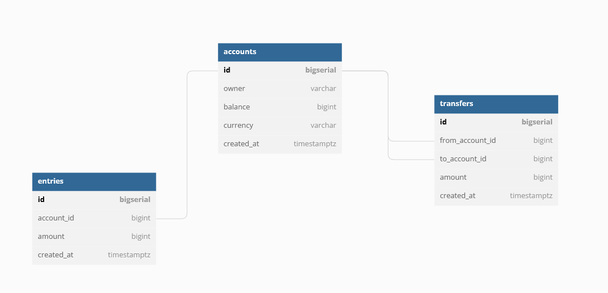

# Banking System

Create and manage bank accounts and money transactions.

## Installation

We launch an image of Postgres locally.

```bash
make postgres
```

Then, we run the migration script (Install from [here](https://github.com/golang-migrate/migrate/tree/master/cmd/migrate)).

```bash
make createdb
make migrateup
```

## DB Schema



```sql
Table users as U {
  username varchar [pk]
  hashed_password varchar [not null]
  full_name varchar [not null]
  email varchar [unique, not null]
  password_changed_at timestamptz [not null, default: '0001-01-01 00:00:00Z']
  created_at timestamptz [not null, default: `now()`]
}

Table accounts as A {
  id bigserial [pk]
  owner varchar [ref: > U.username, not null]
  balance bigint [not null]
  currency varchar [not null]
  created_at timestamptz [not null, default: `now()`]

  Indexes{
    owner
    (owner, currency) [unique]
  }
}

Table entries {
  id bigserial [pk]
  account_id bigint [ref: > A.id, not null]
  amount bigint [not null]
  created_at timestamptz [not null, default: `now()`]

  Indexes{
    account_id
  }
}

Table transfers {
  id bigserial [pk]
  from_account_id bigint [ref: > A.id, not null]
  to_account_id bigint [ref: > A.id, not null]
  amount bigint [not null, note: 'can only be positive']
  created_at timestamptz [not null, default: `now()`]

  Indexes{
    from_account_id
    to_account_id
    (from_account_id, to_account_id)
  }
}
```

Create the migration scripts for the database schema.

```bash
migrate create -ext sql -dir db/migration -seq init_schema
```

## CRUD using [SQLC](https://docs.sqlc.dev/en/latest/overview/install.html)

```bash
sqlc init
```

After populating your `sqlc.yaml` file and putting some queries under ./db/query.

```bash
make sqlc
```

To get rid of the red error lines, create a module for the project.

```bash
go mod init github.com/asqiriba/golang-banking-system
go mod tidy
```

## Run Unit Tests

```bash
make test
```
